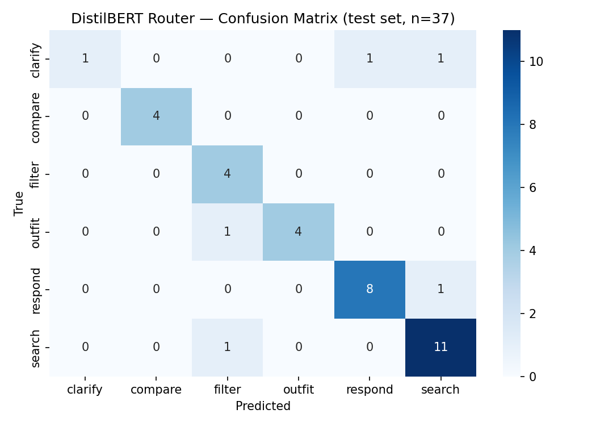

# DistilBERT Router Classifier — Evaluation Report

## Training summary

| Item | Value |
|---|---|
| Base model | distilbert-base-uncased |
| Training examples | 294 |
| Val examples | 37 |
| Test examples | 37 |
| Epochs | 8 |
| Best val macro F1 | 0.8460 (epoch 7) |
| Training time | 23.7s on RTX 3070 Laptop GPU |
| Device | cuda |

## Test-set metrics

| Metric | Value |
|---|---|
| Accuracy | 0.8649 |
| Macro F1 | 0.8263 |

### Per-class breakdown

```
precision    recall  f1-score   support

     clarify       1.00      0.33      0.50         3
     compare       1.00      1.00      1.00         4
      filter       0.67      1.00      0.80         4
      outfit       1.00      0.80      0.89         5
     respond       0.89      0.89      0.89         9
      search       0.85      0.92      0.88        12

    accuracy                           0.86        37
   macro avg       0.90      0.82      0.83        37
weighted avg       0.89      0.86      0.86        37
```

### Confusion matrix



## CPU latency benchmark

> n=100 predictions on CPU (production target)

| Metric | Value |
|---|---|
| Median | 31.4 ms |
| p95 | 37.8 ms |
| Min | 27.5 ms |
| Max | 43.8 ms |

## Error analysis

**5 misclassified examples out of 37:**

| id | query | true | predicted |
|---|---|---|---|
| para_050_3 | I'm looking for something stylish for a loved one, what do y | clarify | search |
| para_052_3 | I'm lost – can you help me decide on a gift for someone whos | clarify | respond |
| edge_002 | Show me face creams and moisturizers | respond | search |
| edge_037 | Blazers but not the pinstriped ones from before | search | filter |
| seed_045 | Complete the look around item 2 | outfit | filter |